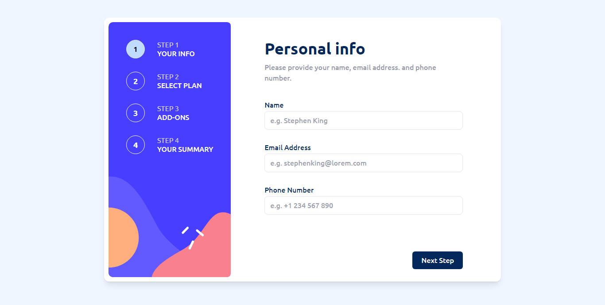

# Frontend Mentor - Multi-step form

This is a solution to the [Multi-step form challenge on Frontend Mentor](https://www.frontendmentor.io/challenges/multistep-form-YVAnSdqQBJ). Frontend Mentor challenges help you improve your coding skills by building realistic projects

## Table of contents

-   [Overview](#overview)
    -   [The challenge](#the-challenge)
    -   [Screenshot](#screenshot)
    -   [Links](#links)
-   [My process](#my-process)
    -   [Built with](#built-with)
    -   [What I learned](#what-i-learned)
-   [Author](#author)

## Overview

## The challenge

Build out this multi-step form and get it looking as close to the design as possible.

You can use any tools you like to help you complete the challenge. So if you've got something you'd like to practice, feel free to give it a go.

Your users should be able to:

-   Complete each step of the sequence
-   Go back to a previous step to update their selections
-   See a summary of their selections on the final step and confirm their order
-   View the optimal layout for the interface depending on their device's screen size
-   See hover and focus states for all interactive elements on the page
-   Receive form validation messages if:
    -   A field has been missed
    -   The email address is not formatted correctly
    -   A step is submitted, but no selection has been made

### Screenshot

### Desktop preview

### Mobile preview

### Links

-   Solution URL: [github](https://github.com/Prechyious/multi-step-form)
-   Live Site URL: 

## My process

-   Built the UI first
-   Then added functionality
-   Then refactored

### Built with

-   Semantic HTML5 markup
-   Mobile-first workflow
-   [React](https://reactjs.org/) - JS library
-   [Tailwindcss](https://tailwindcss.com/) - CSS framework
-   [Redux Toolkit](https://redux-toolkit.js.org/) - For state management

### What I learned

-   I learnt how to manage state with redux toolkit as I used context API earlier on.

## Author

-   Website - [Leghemo Precious](https://leghemo.vercel.app)
-   Frontend Mentor - [@Prechyious](https://www.frontendmentor.io/profile/Prechyious)
-   Twitter - [@lemo_preche](https://www.twitter.com/lemo_preche)
